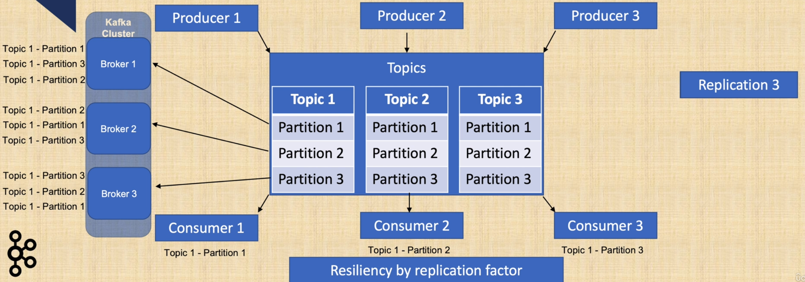

# Notes
## Kafka Basics
- Immutable, append-only logs
- Fast, resilient, scalable, high throughput
- Relies on file system for storing and caching messages
- Resilient and fault-tolerant by replication
- Disk caching, memory mapped files instead of GC eligible memory
- Scale by partitions
- **Ordered inside partition**

## Kafka Architecture

- Increase resiliency level by **Replication Factor**
- Scale out by **partitioning**

## Kafka Producer basics
- The Producer
  - has **buffers of records per topic** partition which are sized at **batch.size** property.
    - the smaller the batch size, the less the throughput and vice versa
      - if batch size is too big, the memory will be wasted since that part of memory is allocated for batching
      - this is because the data will be sent before the batch size limit hits
  - using a **larger batch.size** makes **compression** more efficient and if a data is larger than the batch size, it will not be batched
  - under heavy load, data will most probably be batched
    - however under light load, data may not be batched.
    - in that case, increasing **linger.ms** property **can increase throughput** by increasing batching with fewer requests and with an increased latency on producer send
  - the buffers are sent as fast as broker can keep up.
    - this can be limited by **max.in.flight.requests.per.connection** property
      - if this sets to 1, any subsequent send request will wait the previous one return result
  - by default, producer will wait all replicas to return result as the default value for acknowledge property is **ack=all**
    - by setting **ack=1**, only the broker that gets the request will send confirmation instead of waiting all in-sync replicas
  - the producer property **compression.type** allows to set compression on producer level.
    - default value is **none**.
    - can be set to **none, gzip, snappy or lz4**. Compression is done by batch and improves with larger batch sizes.
  - end to end compression is also possible if Kafka Broker config **compression.type set to producer**
    - the compressed data will be sent from a producer, then goes to the topic and returned to any consumer in the compressed format
  - the Producer config property **request.timeout.ms** default is 30 seconds.
  - the Producer config property **retries** causes to rety a request if producer does not get an ack from kafka broker.
    - defaults to 0
    - if **retries** > 0, to preserve ordering, set **max.in.flight.requests.per.connection = 1**
  - the Producer config property **partitioner.class** sets the partition strategy.
    - by default, partitioner.class is **org.apache.kafka.clients.producer.internals.DefaultPartitioner**
    - default strategy: Round-Robin, send data to each partition equally in rational order

### Summary, kafka producer properties
- Key/Value Serializer Class
- compressionType
- acks
- batchSize
- lingerMs
- requestTimeoutMs
- retryCount

